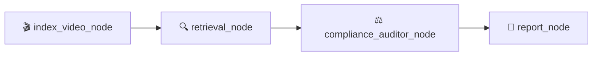

# ComplianceQA — Full Project Guide

## What This Project Does

ComplianceQA is a **YouTube video compliance auditor**. You give it a YouTube URL, and it automatically:

1. **Downloads** the video
2. **Extracts** the transcript (what's said) and on-screen text (what's shown)
3. **Compares** the video content against regulatory compliance documents (FTC influencer guidelines, YouTube ad specs)
4. **Produces** a structured compliance report listing violations, their severity, and timestamps

It's built as a **LangGraph state machine** — a directed graph where each step (node) processes the video data and passes results to the next node via a shared state object.

---

## Architecture Overview


### The Pipeline (LangGraph Nodes)



| Node | What It Does | Inputs from State | Outputs to State |
|---|---|---|---|
| **index_video_node** | Downloads video, extracts transcript + OCR | `video_url`, `video_id` | `transcript`, `ocr_text`, `local_file_path` |
| **retrieval_node** | Embeds transcript chunks, queries Qdrant for relevant compliance rules | `transcript`, `ocr_text` | `video_metadata` (matched compliance rules) |
| **compliance_auditor_node** | LLM compares video content against retrieved rules, finds violations | `transcript`, `ocr_text`, `video_metadata` | `compliance_results` |
| **report_node** | Formats violations into a final compliance report | `compliance_results` | `final_report`, `final_status` |

---

## Your Tech Stack (Open-Source Alternatives)

| Original (Azure) | Your Replacement | Purpose |
|---|---|---|
| Azure Video Indexer | **OpenAI Whisper** (`openai-whisper`) | Transcript extraction |
| Azure Blob Storage | **Local filesystem** (`data/videos/`) | Temp video storage |
| Azure AI Search | **Qdrant** (cloud, already configured) | Vector DB for compliance docs |
| Azure OpenAI Embeddings | **HuggingFace** `sentence-transformers` | Embedding model for RAG |
| Azure OpenAI LLM | **Any LangChain-compatible LLM** (OpenAI, Groq, Ollama, etc.) | Compliance analysis |

---

## Project Structure

```
ComplianceQA/
├── main.py                          # Entry point (stub)
├── pyproject.toml                   # Dependencies
├── .env                             # API keys (Qdrant, LangSmith)
│
├── data/
│   ├── compliance_docs/         # 📚 Source compliance PDFs
│   │   ├── 1001a-influencer-guide-508_1.pdf   # FTC influencer guidelines
│   │   └── youtube-ad-specs.pdf               # YouTube ad specifications
│   └── videos/                  # 🎬 Temp downloaded videos (empty)
│
├── scripts/
│   └── index_documents.py       # 📥 Script to embed PDFs into Qdrant (empty)
│
├── tests/                       # 🧪 Tests (empty)
│
└── src/
    ├── config.py                # ⚙️  Settings (Qdrant creds, model config)
    │
    ├── services/
    │   ├── __init__.py          # Exports VideoIndexerService
    │   └── video_indexer.py     # 🎬 Download + transcribe + OCR service
    │
    ├── graph/
    │   ├── __init__.py          # Exports state types
    │   ├── state.py             # 📊 VideoAuditState TypedDict
    │   ├── nodes.py             # 🔧 Node functions (index, retrieve, audit, report)
    │   └── workflow.py          # 🔗 LangGraph graph definition (empty)
    │
    ├── utils/
    │   ├── __init__.py          # Exports qdrant_client
    │   └── qdrant.py            # Qdrant client initialization
    │
    └── api/
        ├── server.py            # 🌐 FastAPI server (empty)
        └── telemetry.py         # 📈 LangSmith/observability (empty)
```

---

## The State Object

[state.py](file:///home/akshaj/projects/ComplianceQA/src/graph/state.py) defines the data that flows through the graph:

```python
class VideoAuditState(TypedDict):
    video_url: str                    # Input: YouTube URL
    video_id: str                     # Input: identifier for the video
    local_file_path: Optional[str]    # Set by index_video_node
    video_metadata: Dict[str, Any]    # Set by retrieval_node (matched compliance rules)
    transcript: str                   # Set by index_video_node (Whisper output)
    ocr_text: list[str]               # Set by index_video_node (on-screen text)
    compliance_results: list[...]     # Set by auditor_node (append-only via operator.add)
    final_status: str                 # Set by report_node
    final_report: str                 # Set by report_node
    errors: list[str]                 # Append-only error log (any node can write)
```

> [!NOTE]
> Fields using `Annotated[list, operator.add]` are **append-only** — each node adds to them rather than replacing them. This is how `compliance_results` and `errors` accumulate across nodes.

---

## Implementation Phases

### Phase 1: Video Processing Service *(Core — do this first)*

**Goal**: Given a YouTube URL, produce a transcript string.

**Files to implement**:
- [video_indexer.py](file:///home/akshaj/projects/ComplianceQA/src/services/video_indexer.py) — flesh out all 3 methods

**Tasks**:
- [ ] `download_video()` — Use `yt_dlp` Python API to download video to `data/videos/`
- [ ] `transcribe()` — Load a Whisper model, run it on the downloaded file, return the text
- [ ] `extract_ocr()` — Return `[]` for now (implement later with frame extraction + pytesseract if needed)

**Test**: Run the service standalone on a short YouTube video, verify you get transcript text back.

---

### Phase 2: Compliance Document Ingestion *(RAG Foundation)*

**Goal**: Embed the compliance PDFs into Qdrant so they can be queried later.

**Files to implement**:
- [index_documents.py](file:///home/akshaj/projects/ComplianceQA/scripts/index_documents.py) — one-time script
- New file: `src/utils/embeddings.py` — HuggingFace embedding model init

**Tasks**:
- [ ] Initialize a HuggingFace embedding model (e.g. `sentence-transformers/all-MiniLM-L6-v2`)
- [ ] Load PDFs from `data/compliance_docs/` using a LangChain PDF loader
- [ ] Split documents into chunks (e.g. `RecursiveCharacterTextSplitter`)
- [ ] Embed chunks and upsert into a Qdrant collection
- [ ] Run the script once to populate your Qdrant cloud instance

**Test**: Query Qdrant manually with a sample question like "disclosure requirements for sponsored content" and verify relevant chunks come back.

---

### Phase 3: Retrieval Node *(RAG Query)*

**Goal**: Given a transcript, find the most relevant compliance rules from Qdrant.

**Files to implement**:
- [nodes.py](file:///home/akshaj/projects/ComplianceQA/src/graph/nodes.py) — add `retrieval_node()` function

**Tasks**:
- [ ] Take `transcript` and `ocr_text` from state
- [ ] Break transcript into key claims/topics (optionally use LLM to extract key phrases)
- [ ] Query Qdrant with those phrases using the same embedding model from Phase 2
- [ ] Return matched compliance rules as `video_metadata`

**Test**: Feed a sample transcript, verify relevant compliance rules are retrieved.

---

### Phase 4: Compliance Auditor Node *(LLM Analysis)*

**Goal**: Use an LLM to compare video content against compliance rules and identify violations.

**Files to implement**:
- [nodes.py](file:///home/akshaj/projects/ComplianceQA/src/graph/nodes.py) — add `compliance_auditor_node()` function

**Tasks**:
- [ ] Build a prompt template that includes: transcript, OCR text, and retrieved compliance rules
- [ ] Call an LLM (via LangChain) to analyze and identify violations
- [ ] Parse LLM output into `ComplianceIssue` objects (category, description, severity, timestamp)
- [ ] Return as `compliance_results`

**Test**: Run with a known non-compliant transcript, verify violations are detected.

---

### Phase 5: LangGraph Workflow *(Wire it all together)*

**Goal**: Define the graph and run the full pipeline end-to-end.

**Files to implement**:
- [workflow.py](file:///home/akshaj/projects/ComplianceQA/src/graph/workflow.py) — LangGraph definition
- [main.py](file:///home/akshaj/projects/ComplianceQA/main.py) — CLI entry point

**Tasks**:
- [ ] Define the `StateGraph` with `VideoAuditState`
- [ ] Add nodes: `index_video_node` → `retrieval_node` → `compliance_auditor_node` → `report_node`
- [ ] Add edges (linear flow, or conditional edges for error handling)
- [ ] Compile the graph
- [ ] Wire up `main.py` to accept a YouTube URL and invoke the graph
- [ ] Optionally add a `report_node` that formats `compliance_results` into `final_report`

**Test**: Run `python main.py "https://youtube.com/watch?v=..."` end-to-end.

---

### Phase 6: API & Observability *(Production-ready)*

**Goal**: Expose the pipeline via FastAPI and add tracing.

**Files to implement**:
- [server.py](file:///home/akshaj/projects/ComplianceQA/src/api/server.py) — FastAPI app
- [telemetry.py](file:///home/akshaj/projects/ComplianceQA/src/api/telemetry.py) — LangSmith integration

**Tasks**:
- [ ] Create a `POST /audit` endpoint that accepts a YouTube URL
- [ ] Invoke the LangGraph workflow and return the compliance report
- [ ] Set up LangSmith tracing (env vars already in `.env`)
- [ ] Add error handling, validation, and async support

---

## Quick Reference: What's Done vs What's Left

| Component | Status |
|---|---|
| Project structure | ✅ Done |
| `VideoAuditState` | ✅ Done (minor bug to fix) |
| `VideoIndexerService` skeleton | ✅ Done |
| `index_video_node` | ✅ Done |
| Qdrant client init | ✅ Done |
| Config / Settings | ✅ Done (needs new fields) |
| Dependencies in pyproject.toml | ✅ Mostly done (may need `sentence-transformers`) |
| `VideoIndexerService` implementation | ❌ Phase 1 |
| `index_documents.py` | ❌ Phase 2 |
| Embedding model utility | ❌ Phase 2 |
| `retrieval_node` | ❌ Phase 3 |
| `compliance_auditor_node` | ❌ Phase 4 |
| `report_node` | ❌ Phase 4 |
| `workflow.py` (LangGraph) | ❌ Phase 5 |
| `main.py` (CLI trigger) | ❌ Phase 5 |
| `server.py` (FastAPI) | ❌ Phase 6 |
| `telemetry.py` (LangSmith) | ❌ Phase 6 |
